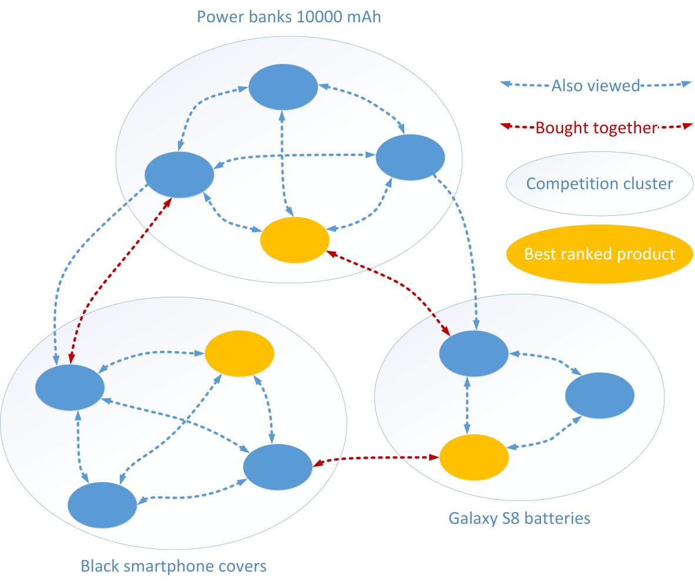

# Gaining insights into the Amazon product network

# Abstract
Buying from huge e-commerce websites such as Amazon has many advantages, but, paradoxically, users are often confused by the vast variety of products.
Users may have a rough idea about the characteristics of the product they want to buy (e.g. a high-end smartphone), and they often undergo the same process of comparing similar products. We aim to remove this redundancy and aid them in this task.
We will use the Amazon reviews/products dataset, which contains relations among products such as "also viewed", "also bought", "bought together", "bought after viewing". These links will be used for creating a graph that represents competing products with similar characteristics, i.e. products that are viewed together but not bought together. Our assumption is that people interested in a certain product would have visualized and compared similar products prior to buying whichever they consider the best. By finding cliques and strongly connected components in this graph, we aim to cluster products into "competing groups" and find useful insights.

# Research questions
By analyzing the clusters in our graph, we could potentially address many questions.
- Is our assumption founded? (Do clusters effectively represent competing products?)
- Given some products with similar characteristics and use cases (e.g. a GPU for mining), can we find the best one? For instance, a suitable metric would be the rank of a product within a cluster.
- Are product choices affected by brand names? Likewise, is the price of a product influenced by its brand?
- Could this project prove useful for users who want both to choose wisely and save time?  The same applies for vendors, who could see how their products relate to competitors' products.

Of course, we do not aim to answer all these questions. Our research will be influenced by the insights that can be found in the graph.

# Dataset
We will use the Amazon dataset, which contains product reviews along with their metadata. The dataset will be transformed into a graph of relations between products, where the vertices represent products, and edges represent competitions between products. For instance, if two products are viewed together (people who viewed product A also viewed product B, and vice versa) but not bought together, they are competitors. On the other hand, two products that are viewed together and bought together are not competitors (e.g. a user buys a smartphone and a cover). A way of expressing this in more formal terms is with max-cliques, that is, finding sets of vertices that are totally interconnected.

The dataset, which has a size of about 20 GB (compressed) in JSON format, contains product metadata, product reviews, and ratings. We are particularly interested in the metadata, as they contain the relations that we want to extract.

We did a preliminary data analysis to evaluate the feasibility of our project. The simplest idea (which will be improved) is to treat "also viewed" relations as competition edges, and "bought together" as non-competition edges (that is, if they are both present, they cancel each other). The feasibility of this project does not only concern the content of the graph, but also the computational cost of the algorithm. Finding max-cliques is an NP-Complete problem, but, if the graph is sparse enough, it should be tractable. Fortunately, we observed that this is the case. Another viable option would be to use a slightly weaker algorithm to extract highly-connected subgraphs (HCS).

Below we show a sample 8-clique extracted by our algorithm, which obviously represents a set of products with similar technical details:
```
- Sony Ericsson K800i Unlocked Triband Cybershot Phone (Black)
- Sony Ericsson W580i Unlocked Cell Phone with 2 MP Camera, MP3/Video Player, Memory Stick Micro--U.S. Version with Warranty (Urban Gray)
- Sony Ericsson W580i Unlocked Cell Phone -- U.S. Warranty
- Sony Ericsson W890i Unlocked Cell Phone with 3.2 MP Camera, MP3/Video Player, M2 Memory Slot--International (Silver)
- Sony Ericsson W302i Quadband GSM Walkman Phone (Unlocked) Black
- Sony Ericsson W595 Quad-band Cell Phone - Unlocked (Black)
- Sony Ericsson T303 Triband GSM World Phone (Unlocked)
- Unlocked GSM Sony Ericsson T303C Music cell phone
```

Another example of a 4-clique:
```
- EGO TALK Bluetooth Handsfree Car Kit
- Scosche BT800 Universal, Automotive In-Vehicle Bluetooth Hands-Free Car Kit with Factory/OEM Appearance
- Scosche BT1000R Universal Bluetooth Handsfree Car Kit (Retail Edition)
- Car Steering Wheel Bluetooth Wireless Handfree Speaker Kit For Mobile Cell Phone BT-005
```

The picture below represents an ideal scenario. It can be seen that cliques, despite being very restrictive, provide a good rule for inferring these clusters of related/competing products. Other rules such as strongly connected components would create clusters that are too big to be meaningful.



# A list of internal milestones up until project milestone 2
- Define the rules for creating the graph (i.e. the influence of each relation type).
- Devise an efficient algorithm for extracting cliques or highly connected subgraphs, and, possibly, merging them into clusters.
- Find useful insights into the structure of these clusters, apart from obvious ones (the best product in a cluster). For example:
-- Do people always choose the most cheap product among related products?
-- Conversely, does the best product cost more than the others?
-- Are the best products sold only by well-known brands?
